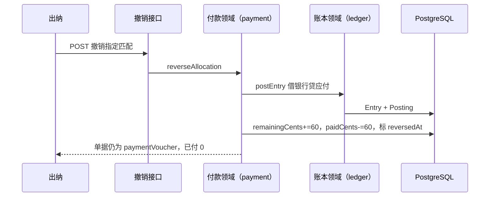
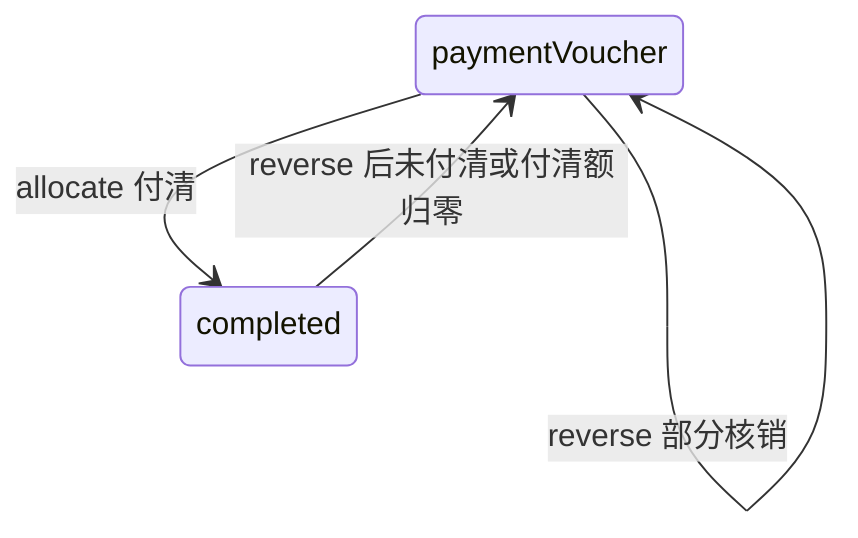

# 付款匹配撤销与红冲

## 1. 目标与边界

**问题**：出纳把流水匹配错了，或金额配多了，当前只能继续往前走；已有核销的单据也不能作废。

**预期结果**：出纳可撤销一笔未红冲的 `PaymentAllocation`：红冲原核销分录（借银行、贷应付）、恢复流水剩余、减少 `paidCents`；若单据已是 `completed`，退回 `paymentVoucher`。付清额回到 0 后，总经理可再作废。

**非目标**：批量撤销、自动选「最近一笔」、改匹配金额（先撤再配）、银行调节表、已结账月份内强行红冲。

**关键约束**：继续只走 `postEntry`；原匹配行保留作审计，标 `reversedAt`；幂等靠 `mutationId`；期间已锁则红冲失败（与其它过账一致）。

## 2. 调研结论

| 做法 | 采用/拒绝 | 理由 |
|---|---|---|
| 物理删除 Allocation + 删原分录 | 拒绝 | 账不可删，审计断链 |
| 红冲分录 + 标记撤销 | 采用 | 与作废应付同一套路 |
| 只允许撤最近一笔 | 拒绝 | 部分付款常有多笔，按 id 撤更直接 |

## 3. 实际示例与流程

单据 128 元，已匹配 60。出纳发现配错流水，撤销该匹配。



异常：非出纳 → 403；匹配已撤销 → 幂等返回原单；期间已锁 → PERIOD_LOCKED；revision 冲突 → 409。

## 4. 状态与数据



| 字段 | 用途 |
|---|---|
| PaymentAllocation.reversedAt | 撤销时间；空=有效 |
| PaymentAllocation.reverseEntryId | 红冲分录 |
| PaymentAllocation.reverseMutationId | 撤销幂等键 |
| Claim.paidCents | 仅统计未撤销匹配之和 |
| Claim.status | paidCents&lt;total → paymentVoucher；=0 且原 completed 也回 paymentVoucher |
| Claim.paymentEntryId | 指向仍有效的最近匹配分录；全撤后清空 |

## 5. 接口

`POST /api/claims/[claimId]/allocations/[allocationId]/reverse`

```json
{
  "expectedRevision": 6,
  "mutationId": "rev-...",
  "remark": "配错流水"
}
```

鉴权：cashier。幂等：同一 `mutationId` 的 ClaimEvent，或该匹配已有 `reverseMutationId`。

## 6. 文件变更

| 操作 | 路径 | 原因 |
|---|---|---|
| 修改 | `prisma/schema.prisma` | Allocation 撤销字段 |
| 修改 | `lib/payment.ts` | reverseAllocation |
| 修改 | `lib/claim.test.ts` | 撤匹配后余额与状态 |
| 新增 | `app/api/claims/.../reverse/route.ts` | HTTP |
| 修改 | `app/page.tsx` | 出纳撤销按钮 |
| 修改 | `design/bank-match.md` | 去掉「不提供撤销」 |
| 修改 | overview / AGENTS | 现状 |

## 7. 实施编排

| ID | 任务 | 依赖 | 串行/并行 | 执行者 | 验证 |
|---|---|---|---|---|---|
| R1 | 本设计 | — | 串行 | 主代理 | 文档可读 |
| R2 | schema + reverseAllocation + 测试 | R1 | 串行 | 主代理 | claim.test 绿 |
| R3 | HTTP + 页面 + 文档推送 | R2 | 串行 | 主代理 | curl/页面可撤 |

## 8. 验证与风险

- 部分撤、全撤、completed→paymentVoucher、重复 mutationId、锁期阻断。
- 作废仍要求 `paidCents=0`；本能力补齐前置条件。
- 红冲发生日沿用原流水 `paidOn`，与期间锁语义一致。
