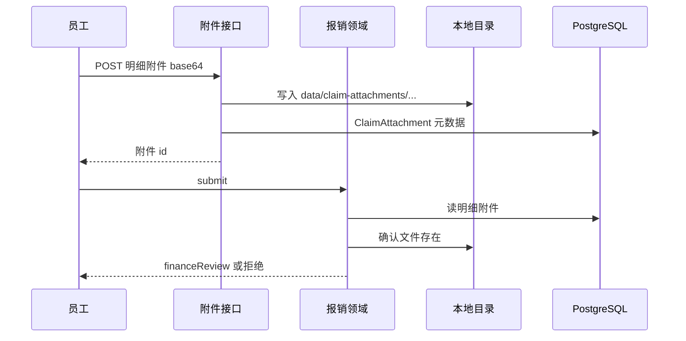

# 报销明细附件

## 1. 目标与边界

**问题**：没有票据附件的报销不能当真提交；财务审批也看不到依据。

**预期结果**：员工给每条明细上传至少一个附件；`submit` 时服务端检查文件确实存在；详情接口返回附件元数据。

**非目标**：对象存储/CDN、OCR、发票号全国查重、缩略图、在线预览编辑器。

**关键约束**：文件先落盘再写库；提交只认已落盘成功的附件；单文件 ≤ 5MB。

## 2. 调研结论

| 候选 | 采用/拒绝 | 理由 |
|---|---|---|
| 旧系统 attachmentRef + 本地文件 | 采用形态 | 与付款回单同一本地目录策略，不引入新基础设施。 |
| S3/MinIO | 拒绝（本版） | 本机闭环优先；目录可后换适配器。 |
| 把 base64 直接塞数据库 | 拒绝 | 胀库、难备份。 |

## 3. 实际示例与流程

张三建草稿（一条明细）→ 上传 `发票.pdf` 到该明细 → submit 成功。无附件 submit → `CLAIM_ATTACHMENT_REQUIRED`。

## 4. 状态与数据

| 字段 | 类型 | 用途 |
|---|---|---|
| ClaimAttachment.id | text PK | 附件 |
| ClaimAttachment.claimItemId | text FK | 归属明细 |
| ClaimAttachment.fileName | text | 原始名 |
| ClaimAttachment.contentType | text | MIME，可空 |
| ClaimAttachment.byteSize | int | 字节数 |
| ClaimAttachment.storagePath | text | 相对路径 |
| ClaimAttachment.uploadedBy | text | 上传人 |
| ClaimAttachment.createdAt | datetime | 时间 |

索引：`claimItemId`。目录：`data/claim-attachments/{claimId}/{itemId}/`。

## 5. 接口与稳定性

`POST /api/claims/[claimId]/items/[itemId]/attachments`  
员工，草稿/驳回态可传：`{fileName, contentType?, fileBase64}`。

`GET` 详情已含 `items.attachments`。本版不单独做下载路由（可用存储路径本机查看）；需要时后补。

`submit`：每条明细 ≥1 个附件且文件存在。

## 6. 文件变更

| 操作 | 路径 | 原因 |
|---|---|---|
| 修改 | schema | ClaimAttachment |
| 新增 | `lib/attachment.ts` | 上传与校验 |
| 修改 | `lib/claim.ts` | submit 校验 |
| 新增 | API route | 上传 |
| 修改 | 测试/页面/overview | 闭环 |

## 7. 实施编排

| ID | 任务 | 验证 |
|---|---|---|
| T1 | 模型 | db push |
| T2 | 上传+submit 校验 | 单测 |
| T3 | HTTP+页面 | curl |

## 8. 验证与风险

- 本机磁盘，无跨机共享。
- 未做病毒扫描。
- 删除明细时级联删元数据；文件可残留，可后补清扫。
