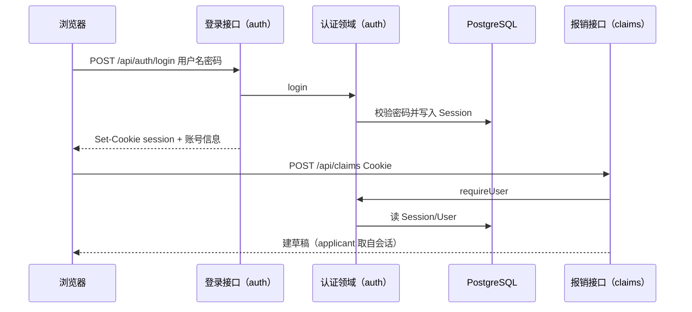

# 登录与角色权限

## 1. 目标与边界

**问题**：报销动作不能再由请求体自称角色；必须先登录，服务端按账号角色鉴权。

**预期结果**：员工/财务/总经理/出纳用账号密码登录；会话 Cookie（或 Bearer）保护写接口；角色决定能做的报销与付款动作。

**非目标**：OAuth、LDAP、复杂权限矩阵、登录失败锁定（可后补）、强制改密流程、多账套数据隔离到用户级。

**关键约束**：密码只存 bcrypt 哈希；会话可吊销；客户端不得再传 `role` 作为权威。

## 2. 调研结论

| 候选 | 采用/拒绝 | 理由 |
|---|---|---|
| iron-session 无表会话 | 部分借鉴 | Cookie 形态可参考；我们需要可吊销，故会话落库。 |
| NextAuth / Auth.js | 拒绝 | 对本内部四角色过重。 |
| 旧系统内存 token | 借鉴角色与接口形状 | 改为 PostgreSQL 持久会话。 |
| 请求体自报角色（当前） | 替换 | 这正是本版要消灭的。 |

## 3. 实际示例与流程

张三（employee）登录 → 建报销草稿 → 提交。财务李登录 → 财务通过。总经理王登录 → 通过并入账。出纳赵登录 → 上传付款凭证并核销应付。

失败：密码错 → 401；无会话 → 401；角色不够 → 403。

## 4. 状态与数据

| 字段 | 类型 | 用途 |
|---|---|---|
| User.id | text PK | 用户 |
| User.username | text unique | 登录名，小写 |
| User.displayName | text | 显示名 |
| User.passwordHash | text | bcrypt |
| User.roles | text | 逗号分隔：employee,finance,gm,cashier |
| User.active | bool 默认 true | 停用 |
| Session.id | text PK=token | 会话令牌 |
| Session.userId | text FK | 用户 |
| Session.expiresAt | datetime | 过期 |
| Session.createdAt | datetime | 创建时间 |

角色与动作：

| 角色 | 可执行 |
|---|---|
| employee | 建草稿、submit |
| finance | financeApprove、reject |
| gm | gmApprove、reject、void |
| cashier | 上传付款凭证并核销应付 |

## 5. 接口与稳定性

| 方法 | 路径 | 作用 |
|---|---|---|
| POST | `/api/auth/login` | `{username,password}` → 会话 |
| POST | `/api/auth/logout` | 吊销当前会话 |
| GET | `/api/auth/me` | 当前用户 |
| POST | `/api/auth/users` | 仅 gm 建用户（本版种子为主，接口留给验收） |

Cookie：`ledger_session` HttpOnly SameSite=Lax。也接受 `Authorization: Bearer <token>` 便于测试。

错误码：`AUTH_INVALID`、`AUTH_REQUIRED`、`AUTH_FORBIDDEN`、`AUTH_INACTIVE`。

## 6. 文件变更

| 操作 | 路径 | 原因 |
|---|---|---|
| 修改 | `prisma/schema.prisma` | User/Session |
| 新增 | `lib/auth.ts` | 登录、会话、requireUser |
| 新增 | `lib/auth.test.ts` | 登录与权限 |
| 新增 | `app/api/auth/**` | login/logout/me |
| 修改 | `lib/claim.ts` 与 API | 角色来自会话 |
| 新增 | `scripts/seed.ts` | 四个演示账号 |
| 修改 | 页面 | 登录区 |

## 7. 实施编排

| ID | 任务 | 依赖 | 验证 |
|---|---|---|---|
| A1 | 本设计 | — | 章节齐 |
| A2 | 模型+seed | A1 | 能登录 |
| A3 | auth 领域与接口 | A2 | 单测 |
| A4 | claims 改鉴权 | A3 | 无会话 401；错角色 403 |

## 8. 验证与风险

- 测试账号仅本地种子；生产需改密。
- 未做暴力破解限流。
- Cookie 在 HTTP 本地无 Secure。
