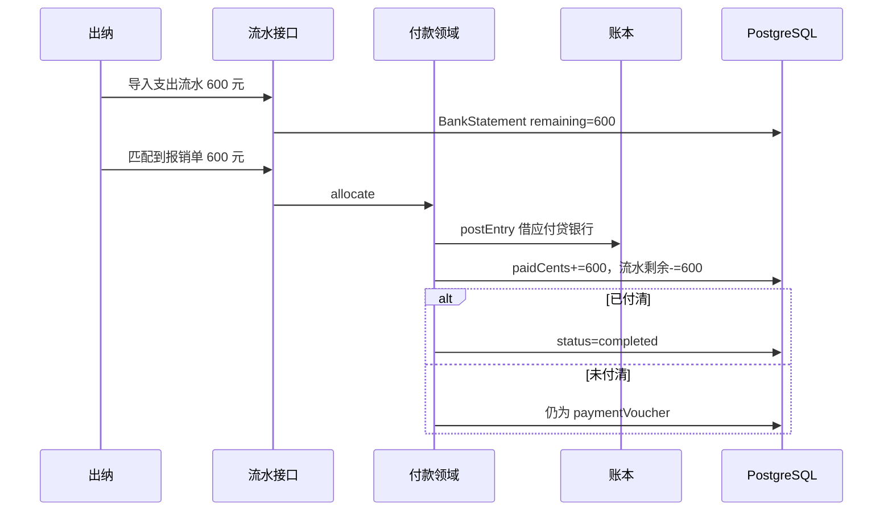

# 银行流水匹配与部分付款

## 1. 目标与边界

**问题**：出纳不能只凭回单就认定银行存款减少；应付常需按实际流水分次核销。

**预期结果**：导入银行支出流水；把流水金额（可部分）匹配到 `paymentVoucher` 单据；每次匹配借应付、贷银行；付清后单据 `completed`。

**非目标**：完整银行调节表、多币种、自动模糊匹配算法、收入流水。撤销匹配见 `allocation-reverse.md`。

**关键约束**：匹配金额 ≤ 流水剩余且 ≤ 单据未付；继续调用 `postEntry`；支付回单文件挂在匹配上作证据，不是选科目的依据。

## 2. 调研结论

旧系统资金匹配过重。本版只留两块积木：**流水** + **匹配**。出纳原「整单付款」接口改为：先落一条流水，再全额匹配，复用同一路径。

## 3. 流程

## 4. 数据

| 表/字段 | 用途 |
|---|---|
| BankStatement | 银行支出流水 |
| .cents / .remainingCents | 原额与未匹配额（分） |
| .bankAccountCode | 贷方银行科目 |
| .reference | 流水号，账套内唯一（可空则用 id） |
| PaymentAllocation | 流水↔单据匹配 |
| Claim.paidCents | 已核销应付 |
| Claim.status | 付清才 completed |

## 5. 接口

- `POST /api/books/[bookId]/statements` 导入流水（cashier|finance）
- `GET /api/books/[bookId]/statements`
- `POST /api/claims/[claimId]/allocations` `{statementId, cents, mutationId, expectedRevision, remark?, fileName?, fileBase64?}`
- 保留 `POST .../payment`：内部「建流水 + 全额/指定额匹配」，兼容页面

## 6. 验证

128 元单：先匹配 60，应付余 68，银行 -60；再匹配 68，完成，应付 0，银行 -128。重复 mutationId 不二次入账。
