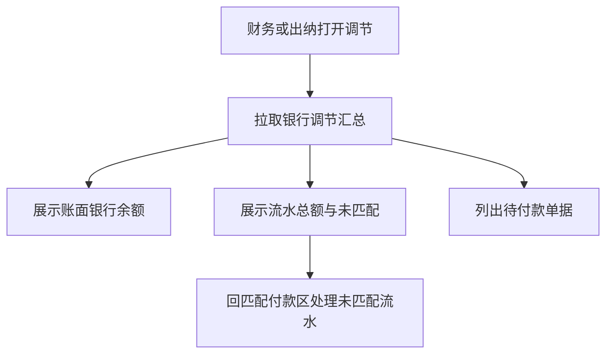

# 银行调节表（最小版）

## 1. 目标与边界

**问题**：出纳导入流水并匹配后，需要一眼看出账面银行存款、已导入支出、已核销、未匹配还差多少。

**预期结果**：按银行科目给出调节汇总：账面余额、流水总额、已匹配、未匹配剩余；列出未匹配流水与仍待付款单据。

**非目标**：企业银行对账单导入格式、勾对勾销 UI、多币种、自动差异分录、收入流水。

**关键约束**：只读汇总，不改账；数据来自现有 `trialBalance`、`BankStatement`、`PaymentAllocation`、`Claim`。

## 2. 调研结论

完整银行调节表（未达账项双向勾对）过重。本版只做**支出侧对照**：账面贷银行（付款）应能被流水匹配解释。

## 3. 流程

## 4. 数据（只读派生）

| 字段 | 含义 |
|---|---|
| bankAccountCode | 银行科目，默认 1002 |
| bookBalanceCents | 账面该科目余额（资产正常借方；付款后常为负或减小） |
| statementTotalCents | 已导入流水支出合计 |
| matchedCents | 未撤销匹配合计 |
| unmatchedCents | 流水 remainingCents 合计 |
| openPayableCents | 状态 paymentVoucher 的未付合计 |
| unmatchedStatements[] | remainingCents&gt;0 的流水 |
| openClaims[] | 待付款单据摘要 |

恒等式（本系统路径下）：`statementTotalCents = matchedCents + unmatchedCents`。

## 5. 接口

`GET /api/books/[bookId]/bank-reconciliation?bankAccountCode=1002`

鉴权：已登录；页面侧重 finance/cashier。

## 6. 文件变更

| 操作 | 路径 | 原因 |
|---|---|---|
| 新增 | `lib/reconciliation.ts` | 汇总 |
| 新增 | `app/api/books/.../bank-reconciliation/route.ts` | HTTP |
| 修改 | `app/page.tsx` | 展示区 |
| 修改 | overview / AGENTS / design 指针 | 现状 |

## 7. 实施编排

| ID | 任务 | 依赖 | 验证 |
|---|---|---|---|
| B1 | 本设计 | — | — |
| B2 | 领域+测试+API+页面 | B1 | 匹配前后数字一致 |

## 8. 验证与风险

- 有匹配、有撤销、无流水三种情况。
- 本版不阻断结账；只提供可见性。
