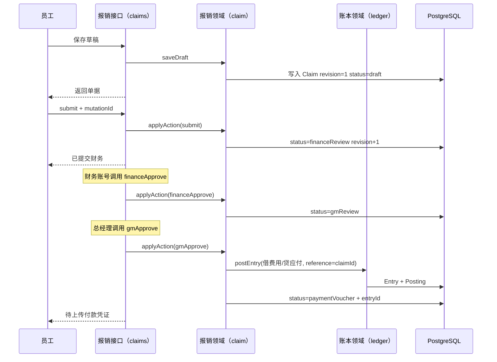
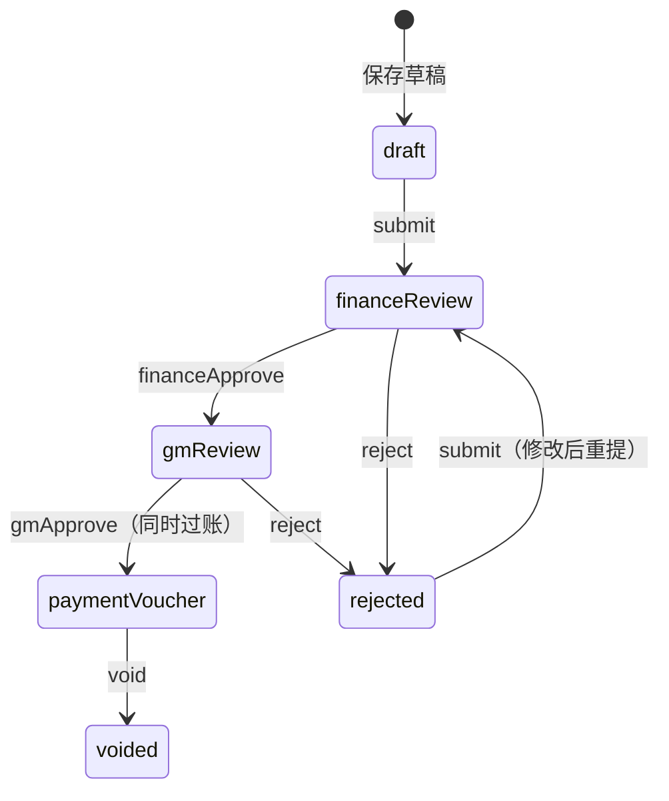
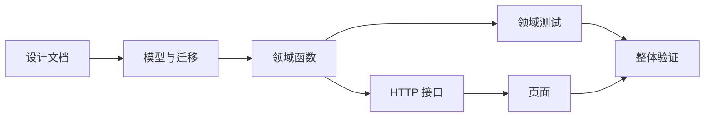

# 报销申请与审批

## 1. 目标与边界

**问题**：员工要把一笔费用变成可审批、可入账的单据；财务和总经理按顺序批；批完后账本里出现对应分录。

**预期结果**：日常费用报销能走完 `草稿 → 财务审 → 总经理审 → 待付款`，总经理通过时调用现有 `postEntry`，借费用、贷应付。

**非目标（本版不做）**：发票号查重库、借支冲减、银行流水匹配、工资、结账、差旅专属字段、对外支付/预付的科目分支。登录、付款核销、明细附件见同目录其它设计。

**关键约束**：
- 复用账本三块积木（账户、分录、过账），报销不另做一套账。
- 接口优先：页面、测试、脚本调用同一套领域函数。
- 金额单位：分。状态机非法迁移直接拒绝，不静默纠正。

## 2. 调研结论

| 候选 | 采用/拒绝 | 理由 |
|---|---|---|
| LedgrStack（费用 + 复式账） | 借鉴 | 费用变更用反向分录、幂等键、append-only；我们已有 `postEntry` 幂等，不搬它的多租户壳。 |
| expense-flow-quest / FinPilot（多级审批） | 借鉴状态顺序 | 保留旧系统已验证的两级审（财务→总经理），不做可配置审批引擎。 |
| 旧系统 server.js 全量迁移 | 拒绝 | 大页面大接口；本版只迁状态机与入账交接。 |
| 可配置工作流引擎 | 拒绝 | 公司当前只有固定两级审，配置引擎是 features before necessity。 |

**改进点**：审批流是单据状态机；入账只在总经理通过时调用账本。付款凭证仍是下一阶段的另一块积木入口。

## 3. 实际示例与流程

输入：员工张三报销办公用品 128.00 元，费用归属「公司公共」，收款人自己。

关键异常：
- 借贷科目缺失 → `ACCOUNT_NOT_FOUND`，单据停在 `gmReview`，不改状态。
- 重复 `mutationId` → 返回原结果，不二次过账。
- `expectedRevision` 不符 → `CLAIM_REVISION_CONFLICT`。
- 非法状态动作 → `CLAIM_STATUS_CHANGED`。

## 4. 状态与数据

| 状态 | 进入条件 | 允许操作 | 下一状态 | 失败/取消 |
|---|---|---|---|---|
| draft | 新建/保存 | submit、改草稿 | financeReview | 字段校验失败 |
| financeReview | submit | financeApprove、reject | gmReview / rejected | 版本冲突 |
| gmReview | financeApprove | gmApprove、reject | paymentVoucher / rejected | 过账失败则保持 gmReview |
| paymentVoucher | gmApprove | void（本版） | voided | — |
| rejected | reject | submit | financeReview | — |
| voided | void | 无 | — | — |

**表**

| 字段 | 类型 | 空值/默认 | 用途 |
|---|---|---|---|
| Claim.id | text PK | 必填，服务端生成 | 单据号 |
| Claim.bookId | text | 必填 | 入账用的账套 |
| Claim.requestType | text | 默认 expense | 本版仅 expense |
| Claim.status | text | draft | 状态机当前位置 |
| Claim.revision | int | 0 | 乐观锁 |
| Claim.lastMutationId | text? | 空 | 幂等 |
| Claim.applicant | text | 必填 | 申请人 |
| Claim.department | text | 必填 | 部门 |
| Claim.costCenter | text | 必填 | 费用归属 |
| Claim.payeeName | text | 必填 | 收款人 |
| Claim.payeeAccount | text | 必填 | 收款账号 |
| Claim.bankName | text | 必填 | 开户行 |
| Claim.purpose | text | 必填 | 事由 |
| Claim.occurredOn | text | YYYY-MM-DD | 业务日，入账日期 |
| Claim.expenseAccountCode | text | 默认 5602 | 借方费用科目 |
| Claim.payableAccountCode | text | 默认 2241 | 贷方应付科目 |
| Claim.totalCents | int | 明细合计 | 冗余合计，便于列表 |
| Claim.entryId | text? | 空 | gmApprove 后的分录 |
| Claim.remark | text? | 空 | 最近审批意见 |
| Claim.createdAt / updatedAt | datetime | now | 审计 |
| ClaimItem.id | text PK | 生成 | 明细 |
| ClaimItem.claimId | text FK | 必填 | 归属单据 |
| ClaimItem.category | text | 可空（expense 可空） | 费用类别 |
| ClaimItem.memo | text | 必填 | 明细说明 |
| ClaimItem.cents | int>0 | 必填 | 金额（分） |
| ClaimEvent.id | text PK | 生成 | 历史 |
| ClaimEvent.claimId | text FK | 必填 | 归属 |
| ClaimEvent.action | text | 必填 | 动作名 |
| ClaimEvent.fromStatus / toStatus | text | 必填 | 迁移 |
| ClaimEvent.actor | text | 必填 | 操作者 |
| ClaimEvent.role | text | 必填 | employee/finance/gm |
| ClaimEvent.mutationId | text | 必填 unique(claimId,mutationId) | 幂等 |
| ClaimEvent.remark | text? | 空 | 意见 |
| ClaimEvent.createdAt | datetime | now | 时间 |

本版不做附件表。索引：`Claim(bookId,status)`、`ClaimEvent(claimId,mutationId)` 唯一。

## 5. 接口与稳定性

| 方法 | 路径 | 作用 |
|---|---|---|
| POST | `/api/claims` | 建草稿（可带明细） |
| GET | `/api/claims?bookId=` | 列表 |
| GET | `/api/claims/[id]` | 详情含明细与事件 |
| POST | `/api/claims/[id]/actions` | `{action, actor, role, expectedRevision, mutationId, remark?}` |

鉴权：本版请求体带 `actor`+`role`，不接登录。角色约束：submit=employee；financeApprove=finance；gmApprove/void=gm；reject=finance|gm。

错误码：`CLAIM_INVALID`、`CLAIM_NOT_FOUND`、`CLAIM_STATUS_CHANGED`、`CLAIM_REVISION_CONFLICT`、`CLAIM_FORBIDDEN`，以及账本原有错误。

幂等：同一 `claimId+mutationId` 返回首次结果。并发：revision 条件更新。事务：`gmApprove` 在同一事务里改状态并 `postEntry`；过账失败整单回滚。

## 6. 文件变更

| 操作 | 文件路径 | 文件职责 | 主要变更 | 修改原因 |
|---|---|---|---|---|
| 修改 | `prisma/schema.prisma` | 数据模型 | 加 Claim/ClaimItem/ClaimEvent | 持久化报销 |
| 新增 | `lib/claim.ts` | 报销领域 | 草稿、动作、入账 | 接口与页面共用 |
| 新增 | `lib/claim.test.ts` | 领域测试 | 状态机与入账断言 | 锁住闭环 |
| 新增 | `app/api/claims/**` | HTTP | 建单/列表/详情/动作 | API-first |
| 修改 | `lib/http.ts` | 错误映射 | 识别 ClaimError | 统一响应 |
| 修改 | `app/page.tsx` | 最小界面 | 报销区 | 同一套接口可点 |
| 修改 | `AGENTS.md` / `overview.html` | 认知入口 | 指向本设计 | 常驻指针 |
| 修改 | `.env.example` | 连接说明 | 系统 PostgreSQL | 去掉 pgbouncer |

## 7. 实施编排

| ID | 任务与交付物 | 前置依赖 | 串行/并行组 | 执行者 | 文件范围 | 验证 |
|---|---|---|---|---|---|---|
| D1 | 本设计文档 | — | 串行/主代理 | 主代理 | `design/claims.md` | 章节齐全 |
| D2 | Prisma 模型 + db push | D1 | 串行/主代理 | 主代理 | `prisma/schema.prisma` | `\dt` 见新表 |
| D3 | `lib/claim.ts` + 测试 | D2 | 串行/主代理 | 主代理 | `lib/claim.ts` `lib/claim.test.ts` | npm test |
| D4 | claims HTTP | D3 | 串行/主代理 | 主代理 | `app/api/claims/**` `lib/http.ts` | curl 闭环 |
| D5 | 页面报销区 | D4 | 串行/主代理 | 主代理 | `app/page.tsx` | 页面 200 + 接口 |
| D6 | 文档与推送 | D5 | 串行/主代理 | 主代理 | AGENTS/overview/git | push 成功 |

## 8. 验证与风险

- 测试：草稿→提交→财务→总经理后试算平衡；重复 mutationId 不二次入账；错误状态拒绝。
- 构建：`tsc --noEmit`、`next build`（或 dev 启动）。
- 未覆盖：真登录、附件、发票查重、付款入账、银行对账。
- 剩余风险：本版用请求体角色，不能当生产权限；默认科目代码需账套里先建好。
