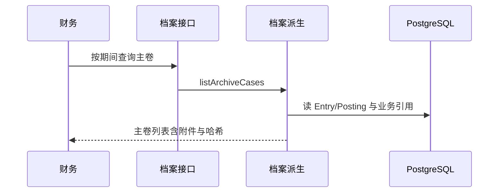

# 电子档案主卷归集

## 1. 目标与边界

**问题**：结账后需要按会计凭证追溯业务附件与来源单据；分散在报销、工资、资产、付款里不好查。

**预期结果**：

1. 以已过账 `Entry` 为主卷中心，归集分录行、业务引用、附件元数据。
2. 按期间筛选；关键词搜凭证号/摘要/来源。
3. 对分录内容算内容哈希，便于日后校验（四性检测的「完整性」最小切片）。

**非目标**：签章、OFD、完整四性检测套件、物理归档交接、另建档案库表、把附件再拷一份。

## 2. 认知

档案是**已过账事实的派生视图**。权威仍在 Entry / ClaimAttachment / PaymentVoucher；主卷编号用 `occurredOn` 月份 + `reference`（或 entry id 短码）。

## 3. 流程

## 4. 接口

- `GET /api/books/{bookId}/archive?period=YYYY-MM&keyword=`
- `GET /api/books/{bookId}/archive/{entryId}`

## 5. 归集来源

| 来源 | 关联字段 |
|---|---|
| 报销过账/付款 | Claim.entryId / paymentEntryId；明细 ClaimAttachment |
| 付款回单 | PaymentAllocation.entryId + voucherNo |
| 工资计提/付款 | PayrollBatch.entryId；PayrollPaymentAllocation.entryId |
| 固定资产 | FixedAsset.acquisitionEntryId / disposeEntryId；FixedAssetDepreciation.entryId |

## 6. 验证

报销过账后档案能见凭证与发票附件；折旧分录能见资产引用。
