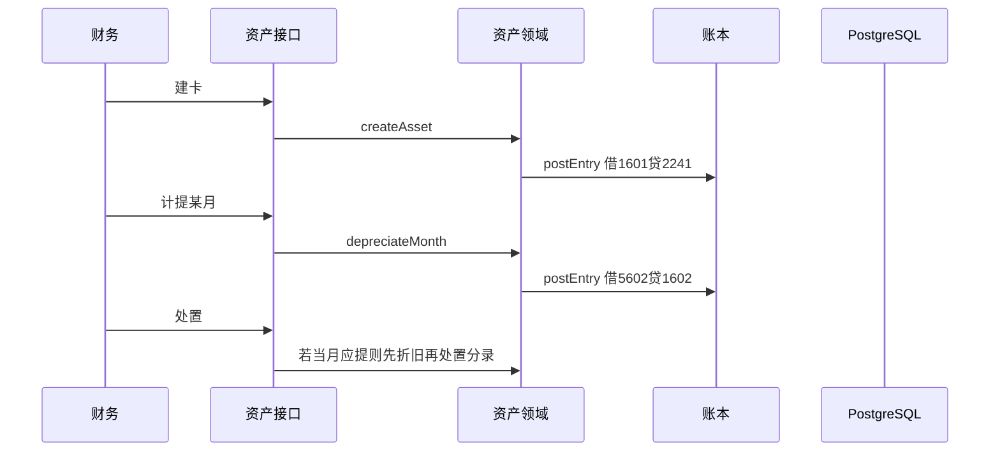

# 固定资产最小闭环

## 1. 目标与边界

**问题**：结账与报表需要资产原值、累计折旧与月折旧费用；新账本尚无资产积木。

**预期结果**：

1. 财务建卡（名称、启用日、原值分、残值率%、使用月数）。
2. 次月起按直线法计提；最后一期吸收分币尾差。
3. 折旧 / 处置均走 `postEntry`。
4. 应提未提折旧阻断该月结账。

**非目标**：旧资产初始化、部门转移、减值、盘点、从报销自动拆卡、多折旧方法。

**政策（对齐旧系统 / 金蝶常用默认）**：启用次月起提；处置当月先提后处置；普通停用本版用 `disposed`/`active` 两态即可（停用后置）。

## 2. 调研

金蝶/用友：卡片 + 期末计提 + 凭证 + 结账门槛。  
开源 bookkeeping：Asset → DepreciationRun → Journal。  
采用：卡片 + 折旧运行记录 + 唯一分录引用。

## 3. 流程

## 4. 数据

| 模型 | 关键字段 |
|---|---|
| FixedAsset | bookId, code, name, startOn, costCents, residualRatePercent(0–100,默认5), usefulMonths, status, accumDepCents, acquisitionEntryId, disposedAt |
| FixedAssetDepreciation | assetId, yearMonth, cents, entryId；唯一 (assetId,yearMonth) |

科目种子：1601 固定资产、1602 累计折旧。

## 5. 接口

- `POST /api/books/{bookId}/fixed-assets` 建卡
- `GET /api/books/{bookId}/fixed-assets`
- `POST /api/books/{bookId}/fixed-assets/depreciate` `{yearMonth, mutationId}` 批量应提
- `POST /api/fixed-assets/{id}/dispose` `{occurredOn, mutationId, remark}`

## 6. 结账

`closePeriod` 增加：存在 active 且该月应提但无折旧记录 → `PERIOD_HAS_OPEN_DEPRECIATION`。

## 7. 验证

成本 120000 分、残值 5%、12 期；次月起每月约 9500；末月吃尾差；处置后不可再提。
