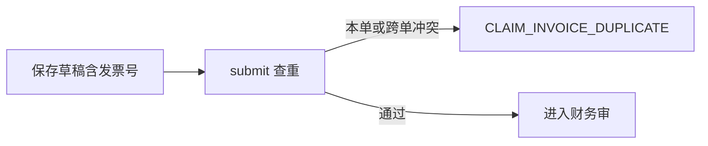

# 发票号查重

## 1. 目标与边界

**问题**：同一张发票被多张报销单重复提交，会造成重复费用。

**预期结果**：明细可填发票号；本单内不可重复；与未作废单据上的发票号冲突时，`submit` 拒绝。

**非目标**：税务局真伪查验、历史发票池导入 UI、无票/支付截图的强制发票号。

**关键约束**：发票号规范化后再比（去空白、大写）；`voided` 单据上的号可再使用；空发票号不参与查重（本版仍允许无号，但有号就必须唯一）。

## 2. 调研结论

沿用旧系统：`normalizeInvoiceNo` + 本单 Set + 跨单来源提示。不引入独立发票池表——以单据明细为权威，避免双写。

## 3. 流程

## 4. 数据

`ClaimItem.invoiceNo String @default("")`，索引便于查找：`@@index([invoiceNo])`（空串多条允许）。

## 5. 接口

草稿字段增加 `items[].invoiceNo`。`submit` 返回冲突码与已占用单据号。

## 6. 文件

schema、claim 领域与测试、页面输入、overview。

## 7. 验证

同号两单：第二单 submit 失败；作废后可再报。
