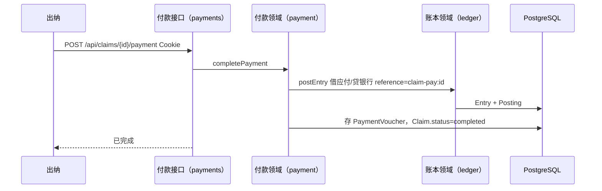
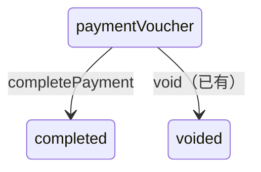

# 付款凭证与核销应付

## 1. 目标与边界

**问题**：总经理通过后单据在 `paymentVoucher`，账上已有「贷应付」。出纳上传支付回单后，要核销应付并减少银行存款。

**预期结果**：出纳对 `paymentVoucher` 单据提交付款凭证（凭证号、付款日、银行科目、回单内容）；系统借应付、贷银行，单据变 `completed`。

**非目标**：银行流水导入与匹配、部分付款、多银行拆分、OCR 识别回单、附件对象存储服务（本版文件落本地目录）、作废后的红冲付款。

**关键约束**（与旧系统一致）：支付回单是流程证据，不是自动选银行科目的依据；核销分录显式指定银行科目；调用现有 `postEntry`，幂等键 `claim-pay:{claimId}`。

## 2. 调研结论

| 候选 | 采用/拒绝 | 理由 |
|---|---|---|
| 旧系统 funds 流水匹配后再制证 | 本版简化 | 先做「凭证上传即全额核销」最小闭环；流水匹配后补。 |
| 金蝶：费用确认与付款拆两张凭证 | 采用 | 我们已在 gmApprove 确认应付；付款再借应付贷银行。 |
| 把回单金额当银行入账唯一依据且无科目 | 拒绝 | 必须指定银行科目。 |

## 3. 实际示例与流程

单据已 `paymentVoucher`，应付 128.00。出纳赵上传回单，银行科目 `1002`，付款日 2026-10-03。



异常：非 cashier → 403；状态不是 paymentVoucher → 409；银行科目不存在 → 账本错误；重复 mutationId → 返回原结果。

## 4. 状态与数据



| 字段 | 类型 | 用途 |
|---|---|---|
| PaymentVoucher.id | text PK | 付款凭证 |
| PaymentVoucher.claimId | text unique | 一单一张（本版全额） |
| PaymentVoucher.voucherNo | text | 回单号 |
| PaymentVoucher.paidOn | text YYYY-MM-DD | 付款日 |
| PaymentVoucher.bankAccountCode | text | 贷方银行科目 |
| PaymentVoucher.cents | int | 付款金额（本版=单据合计） |
| PaymentVoucher.fileName | text | 回单文件名 |
| PaymentVoucher.storagePath | text | 本地相对路径 |
| PaymentVoucher.remark | text | 说明 |
| PaymentVoucher.entryId | text | 核销分录 |
| PaymentVoucher.uploadedBy | text | 出纳显示名 |
| Claim.paymentEntryId | text? | 指向核销分录 |
| Claim.status | completed | 完成后 |

文件存 `data/payment-vouchers/{claimId}/{safeName}`，不进 git。

## 5. 接口与稳定性

`POST /api/claims/[claimId]/payment`

JSON 或 multipart。本版用 JSON + base64 内容，便于测试：

```json
{
  "expectedRevision": 4,
  "mutationId": "...",
  "voucherNo": "BANK20261003001",
  "paidOn": "2026-10-03",
  "bankAccountCode": "1002",
  "remark": "已付",
  "fileName": "receipt.pdf",
  "fileBase64": "..."
}
```

鉴权：cashier。事务内：写文件元数据、`postEntry`、更新 Claim。幂等：mutationId + reference。

## 6. 文件变更

| 操作 | 路径 | 原因 |
|---|---|---|
| 修改 | schema | PaymentVoucher、Claim 字段 |
| 新增 | `lib/payment.ts` | 核销 |
| 新增 | `lib/payment.test.ts` | 闭环 |
| 新增 | `app/api/claims/[claimId]/payment/route.ts` | HTTP |
| 修改 | 页面 | 出纳付款区 |
| 修改 | overview / AGENTS | 现状 |

## 7. 实施编排

| ID | 任务 | 依赖 | 验证 |
|---|---|---|---|
| P1 | 本设计 | auth | — |
| P2 | 模型 | P1 | db push |
| P3 | payment 领域+测试 | P2+auth | 应付余额回落、银行减少 |
| P4 | HTTP+页面 | P3 | curl 闭环 |

## 8. 验证与风险

- 本版只支持一次全额付款。
- 文件仅本机目录，无 CDN。
- 未接银行流水，不能证明「银行已付」与科目外的外部事实。
