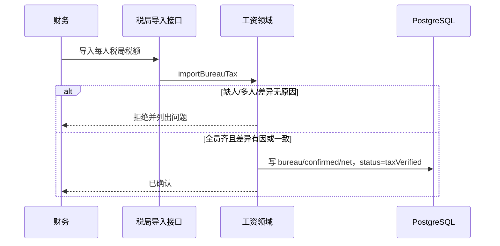

# 税局个税导入与期初累计

## 1. 目标与边界

**问题**：最小工资闭环已能试算并手工确认个税，但财务实际工作是「扣缴端算出一版税 → 与系统对照 → 有差异则留痕确认」。跨年/中途上线时，还没有系统内已过账批次，需要期初累计台账，否则 2 月及以后无累计会把减除费用算空。

**预期结果**：

1. 财务对 `calculated` 批次导入税局结果（按人员编号）；系统报告缺人/多人/差异。
2. 差异须填原因；确认后写入 `bureauTaxCents` + `confirmedTaxCents`，重算实发，进入 `taxVerified`。
3. 财务可维护某年某人的期初累计（应发/个人社保/公积金/已扣税）；计税时：期初 + 同年已过账批次，再加行上手工 prior（若显式传入则覆盖自动）。

**非目标**：XLSX/税局在线接口、劳务报酬、非居民、专项附加扣除明细台账 UI。

**关键约束**：金额分；API-first；幂等 mutationId；不接 OSS。

## 2. 调研结论

| 来源 | 结论 |
|---|---|
| 旧 `verifyPayrollTax` | 采用：全员覆盖、缺人/多人拒绝、差异要原因、保留系统试算与税局数 |
| 旧 opening tax ledger | 采用：按人+年累加起点；拒绝用人事表当累计事实来源 |
| 公开仓库 | 无可靠中国个税+Prisma 全套；沿用已有累计预扣纯函数 |

## 3. 流程

期初：财务 `upsertOpeningTax` → 下次 `setLines` 自动带入 prior。

## 4. 数据

| 模型/字段 | 用途 |
|---|---|
| PayrollLine.bureauTaxCents | 税局导入税额；-1 表示未导入（用 null 语义：可空 Int?） |
| PayrollOpeningTax | bookId+year+personCode 唯一；累计应发/社保/公积金/已扣税 |

## 5. 接口

- `POST /api/payroll/batches/{id}/bureau-tax`  
  `{ expectedRevision, mutationId, results: [{ personCode, bureauTaxCents, confirmedTaxCents?, reason? }] }`  
  鉴权 finance|gm；成功则 taxVerified。
- `PUT /api/books/{bookId}/payroll/opening-tax`  
  `{ year, mutationId, lines: [{ personCode, personName?, grossCents, siCents, hfCents, taxCents }] }`  
  鉴权 finance|gm；按人 upsert。
- `GET /api/books/{bookId}/payroll/opening-tax?year=`

## 6. 文件

schema、`lib/payroll.ts`、测试、API、page、overview、本设计。

## 7. 编排

串行：设计 → 领域+测 → HTTP+页+推送。

## 8. 验证

- 导入一致 → taxVerified；差 20 元无原因拒绝；有原因通过且 net 按确认税。
- 期初 9 月累计后，10 月试算 prior 正确。
