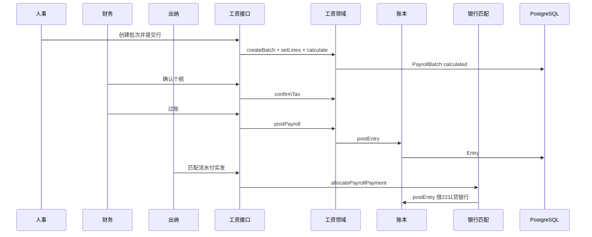
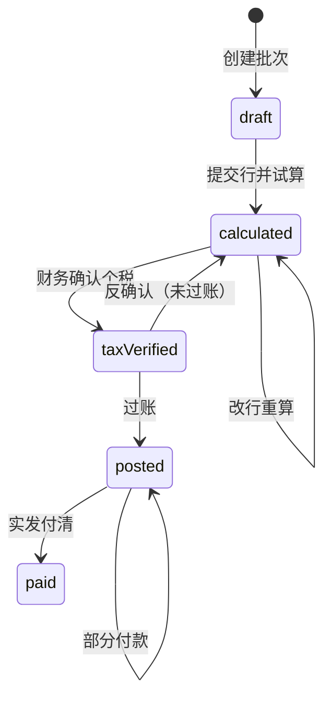

# 工资批次最小闭环

## 1. 目标与边界

**问题**：上线范围含「报销到总账、工资、结账报表」。账本已有报销/付款/结账；工资仍缺。人事要能只交应发与个人扣款，系统试算个税与实发；财务核对确认后入账，出纳用银行流水付实发。

**预期结果**（本版最小闭环）：

1. 人事（或兼岗）导入/提交一期工资行：人员编号、姓名、应发、个人社保、个人公积金、其他扣款（单位：分）。
2. 系统按居民工资薪金累计预扣法试算本期个税与实发（累计来自本账套同年已过账批次；首期累计为 0，可选手动期初）。
3. 财务确认本期个税（可按人覆盖为税局数并写原因），锁定批次。
4. 财务过账：一笔平衡分录进入现有 `postEntry`。
5. 出纳用已有银行流水，按实发合计（可分次）核销，付清后批次 `paid`。

**非目标（本版不做）**：

- 完整社保政策引擎、公积金单位规则引擎、社保批次与工资批次双轨（旧 `social-insurance-workflow` 整迁）。
- 劳务报酬、非居民、年终奖单独算法。
- 电子税务局在线接口、XLSX 解析（税局结果走 JSON API，见 `payroll-tax-import.md`；文件解析可后补）。
- 工资付款红冲 UI、研发费用工资分摊、多成本中心。
- 把旧 JSON 档案整包迁移。

**关键约束**：

- 积木：工资是「提议分录的单据」；钱只经 `postEntry` / 银行匹配进账。
- API-first：领域函数可被测试、脚本、页面共用；无「只能点 UI」的动作。
- 金额一律整数分；显示层再除 100。
- 幂等：`mutationId`；乐观锁：`revision`。
- 结账：未过账/未付清的工资批次阻断该月 `closePeriod`（与未完报销同级）。

## 2. 调研结论

| 候选 | 结论 | 理由 |
|---|---|---|
| 旧 `payroll-workflow.js` + 2026-09-28 计划 | **采用规则与分工** | 人事只交四类数；累计预扣；财务确认税局数；不接税局在线接口 |
| [alex5272372/payroll](https://github.com/alex5272372/payroll) | 借鉴批次形态 | Next/Prisma 批次计算；不搬多租户/多国 |
| [skycloud112/payroll-case-study-uncle-bob](https://github.com/skycloud112/payroll-case-study-uncle-bob) | 借鉴 | Payday日/批次命令与领域分离 |
| [Ignareo/SalaryCalculator](https://github.com/Ignareo/SalaryCalculator) | 借鉴税率表 | 累计预扣法；我们自写分单位整数版，不引前端库 |
| 完整社保工作流整迁 | **拒绝本版** | 与工资耦合深、状态多；本版个人社保/公积金作行上输入，单位部分可选填入账 |

**改进点**：旧系统工资与 JSON 总账缠在一起。新系统工资批次只产出「要过的分录」和「要付的实发」，账与流水复用 ledger/payment 积木。

## 3. 实际示例与流程

输入：2026-01，E001 张三应发 10_000.00 元，个人社保 1_000，公积金 500，其他 0；无前期累计。

- 累计收入 10000，减除 5000，专项 1500 → 应纳税所得额 3500 → 税率 3% → 试算个税 105 元。
- 实发 = 10000 - 1000 - 500 - 105 = 8395 元。
- （若无前期累计却选在 2 月及以后，减除费用按月数累加，本期税可为 0，这是累计预扣法正常现象。）
- 财务确认税 105（与试算一致）。
- 过账（单位社保/公积金本例为 0）：

```text
借 5602 管理费用  1_000_000 分
  贷 2211 应付职工薪酬  839_500
  贷 2221 应交税费-个税    10_500
  贷 2241 其他应付款-代扣  150_000   // 个人社保+公积金+其他
```

- 出纳导入银行支出 8395 元，匹配本批次 → 借 2211 / 贷 1002；`paidCents` 累加至实发合计则 `paid`。



异常：未确认税不能过账；实发未付清不能标 paid；锁期月份不能过账/付款；超额匹配拒绝。

## 4. 状态与数据



| 状态 | 进入条件 | 允许操作 | 下一状态 | 失败/取消 |
|---|---|---|---|---|
| draft | 新建 | 写行、删除空批次 | calculated | — |
| calculated | 行校验+试算成功 | 改行、确认税 | taxVerified | 行非法 |
| taxVerified | 每人有确认税额 | 过账、反确认 | posted / calculated | 缺税额 |
| posted | 分录已生成 | 付款匹配 | paid | 锁期 |
| paid | paidCents=netTotal | 查询 | — | — |

### 表 `PayrollBatch`

| 字段 | 类型 | 用途 |
|---|---|---|
| id | string | 主键 |
| bookId | string | 账套 |
| period | YYYY-MM | 工资所属月 |
| taxPeriod | YYYY-MM | 税款所属月（默认同 period） |
| status | string | 上表状态 |
| revision | int | 乐观锁 |
| lastMutationId | string? | 最近幂等键 |
| grossCents / employeeSiCents / housingFundCents / otherDeductionCents / taxCents / netCents / employerSiCents / employerHfCents | int | 合计缓存 |
| paidCents | int | 已匹配实发 |
| entryId | string? | 过账分录 |
| lockedAt / lockedBy | 确认税时写入 | 防改行 |
| remark | string | 说明 |
| createdBy | string | 创建人 |

### 表 `PayrollLine`

| 字段 | 用途 |
|---|---|
| personCode / personName | 人员 |
| grossCents 等扣款项 | 人事输入 |
| estimatedTaxCents | 系统试算 |
| confirmedTaxCents | 财务确认（默认=试算） |
| taxAdjustReason | 与试算不一致时必填 |
| netCents | 实发 |
| priorGrossCents / priorTaxCents / priorSiCents / priorHfCents | 计算用期初累计（分） |

### 表 `PayrollPaymentAllocation`

同报销匹配：statementId、cents、entryId、mutationId、可红冲字段；目标为 batch 实发。

### 种子科目

| 代码 | 名称 | 方向 |
|---|---|---|
| 2211 | 应付职工薪酬 | 负债 |
| 2221 | 应交税费 | 负债 |
| （已有）5602 / 1002 / 2241 | 费用/银行/其他应付 | — |

代扣个人社保公积金本版记入 `2241`，避免未建明细科目时无法过账。

## 5. 接口与稳定性

鉴权：`hr` 或 `finance` 建批次与写行；`finance` 确认税/过账；`cashier` 付款匹配；只读登录可列表本账套。

| 方法 | 路径 | 说明 |
|---|---|---|
| POST | `/api/books/{bookId}/payroll/batches` | 创建 `{period, taxPeriod?, remark?, mutationId}` |
| GET | `/api/books/{bookId}/payroll/batches` | 列表 |
| GET | `/api/payroll/batches/{id}` | 详情含行 |
| PUT | `/api/payroll/batches/{id}/lines` | 整表替换行并重算 `{expectedRevision, mutationId, lines[]}` |
| POST | `/api/payroll/batches/{id}/confirm-tax` | `{expectedRevision, mutationId, lines?: [{lineId, confirmedTaxCents, reason?}]}` |
| POST | `/api/payroll/batches/{id}/unconfirm-tax` | 回到 calculated（未过账） |
| POST | `/api/payroll/batches/{id}/post` | 过账 |
| POST | `/api/payroll/batches/{id}/payments` | 匹配流水付实发 |
| POST | `/api/payroll/batches/{id}/payments/{allocationId}/reverse` | 红冲匹配 |

错误码：`PAYROLL_INVALID` / `PAYROLL_STATUS` / `PAYROLL_REVISION_CONFLICT` / `PAYROLL_TAX_REQUIRED` / `PAYROLL_ALREADY_POSTED` / `INSUFFICIENT_STATEMENT` / 复用 `PERIOD_LOCKED`。

计税：移植旧规则整数分版；`MONTHLY_BASIC_DEDUCTION=500000` 分；税率表同 2018 累计预扣。

并发：更新 `where revision=expected`；`mutationId` 唯一则幂等返回。

结账守卫：`closePeriod` 增加——该月存在 status 非 `paid` 且非空的批次则 `PERIOD_HAS_OPEN_PAYROLL`。

## 6. 文件变更

| 操作 | 路径 | 职责 | 原因 |
|---|---|---|---|
| 修改 | `prisma/schema.prisma` | Batch/Line/Allocation、Book 关系 | 持久化 |
| 修改 | `lib/auth.ts` + seed | 角色 `hr` | 人事入口 |
| 新增 | `lib/payroll-tax.ts` | 纯函数计税 | 可单测 |
| 新增 | `lib/payroll.ts` | 批次状态机与过账/付款 | 领域 |
| 新增 | `lib/payroll.test.ts` | 计税+闭环 | 回归 |
| 修改 | `lib/ledger.ts` | 种子 2211/2221；结账检查工资 | 积木衔接 |
| 新增 | `app/api/.../payroll/**` | 薄 HTTP | API-first |
| 修改 | `app/page.tsx` | 工资区块 | 可操作 |
| 新增 | `design/payroll.md` | 本文 | 事前设计 |
| 修改 | overview / AGENTS | 现状 | 注意力链 |

## 7. 实施编排


| ID | 任务 | 依赖 | 执行者 | 验证 |
|---|---|---|---|---|
| P0 | 本设计 | — | 主代理 | 文档可读 |
| P1 | schema、hr 角色、计税纯函数与单测 | P0 | 主代理 | 税率样例断言 |
| P2 | payroll 领域 + 结账守卫 + 测试闭环 | P1 | 主代理 | `npm test` |
| P3 | API + 页面 + overview 推送 | P2 | 主代理 | curl 闭环 |

全部串行、主代理；文件重叠不并行。

## 8. 验证与风险

- 样例：无累计 10000/1000/500 → 税 10500 分、实发 839500 分。
- 确认税改为 12000 分后实发与分录跟着变；过账后改行拒绝。
- 流水分次付、超额拒绝、撤销匹配恢复。
- 未覆盖：劳务税、多月累计滚存与期初导入 UI、单位社保明细科目、税局文件解析。
- 风险：税率政策变更需改 `payroll-tax.ts` 版本常量；2241 混放代扣项，报表要按明细拆时再加子目。
