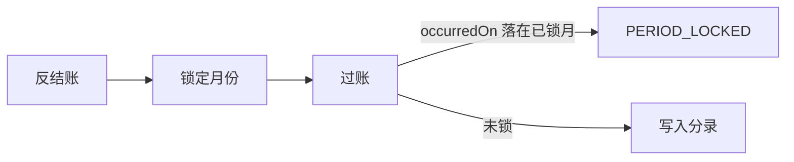

# 会计期间锁定

## 1. 目标与边界

**问题**：已结月仍被写入分录，账面与结账结果会漂。

**预期结果**：财务/总经理可锁定 `YYYY-MM`；`postEntry` 拒绝写入该月；可按月反结账（需原因）。

**非目标**：自动损益结转、未匹配流水阻断、跨账套统一关账。未完成审批/待付款单据会阻断结账。

**关键约束**：所有入账路径（手工、报销确认、流水匹配）都走 `postEntry`，锁只守这一道门。

## 2. 流程

## 3. 数据

`AccountingPeriod(bookId, yearMonth, lockedAt, lockedBy, remark?)`，`@@unique([bookId, yearMonth])`。

## 4. 接口

- `GET /api/books/[bookId]/periods`
- `POST /api/books/[bookId]/periods/close` `{yearMonth, remark?}`
- `POST /api/books/[bookId]/periods/reopen` `{yearMonth, remark}` finance|gm

## 5. 验证

锁 2026-09 后，发生日 2026-09-15 的过账失败；2026-10 成功；反结账后 9 月可再过。
