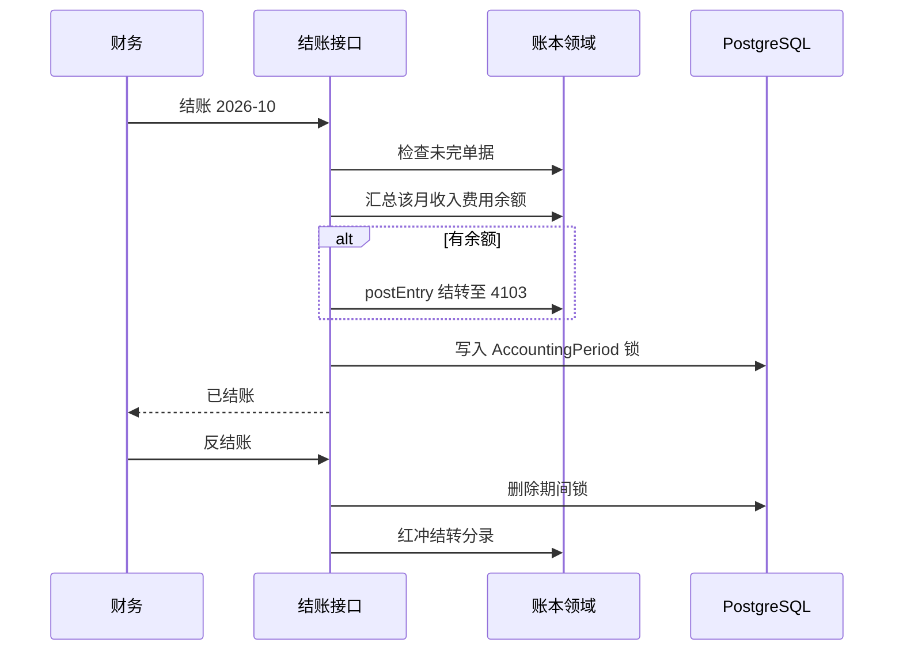

# 期间结转损益

## 1. 目标与边界

**问题**：锁期只挡住继续过账，费用/收入科目余额仍挂着，试算表看不出本月已结。

**预期结果**：财务结账时，把该月收入、费用余额结转到 `4103 本年利润`，再锁期；反结账先解锁，再红冲结转分录。

**非目标**：利润分配、盈余公积、跨年结转未分配利润、多账套合并报表。

**关键约束**：结转分录仍走 `postEntry`；发生日取该月最后一天；锁期写在结转成功之后，避免自己把自己锁死。

## 2. 流程

## 3. 数据

| 项 | 说明 |
|---|---|
| 4103 | 本年利润（权益，开账种子） |
| reference `pl-close:YYYY-MM` | 结转分录幂等键 |
| reference `pl-reopen:YYYY-MM` | 反结账红冲幂等键 |
| occurredOn | 该月最后一天 |

## 4. 接口

沿用现有 close/reopen；响应可带 `closingEntryId`。页面结账后刷新试算表即可看见费用归零、本年利润变化。

## 5. 验证

报销入账管理费用 128 后结账：5602=0，4103 借方 128；反结账后费用恢复。
