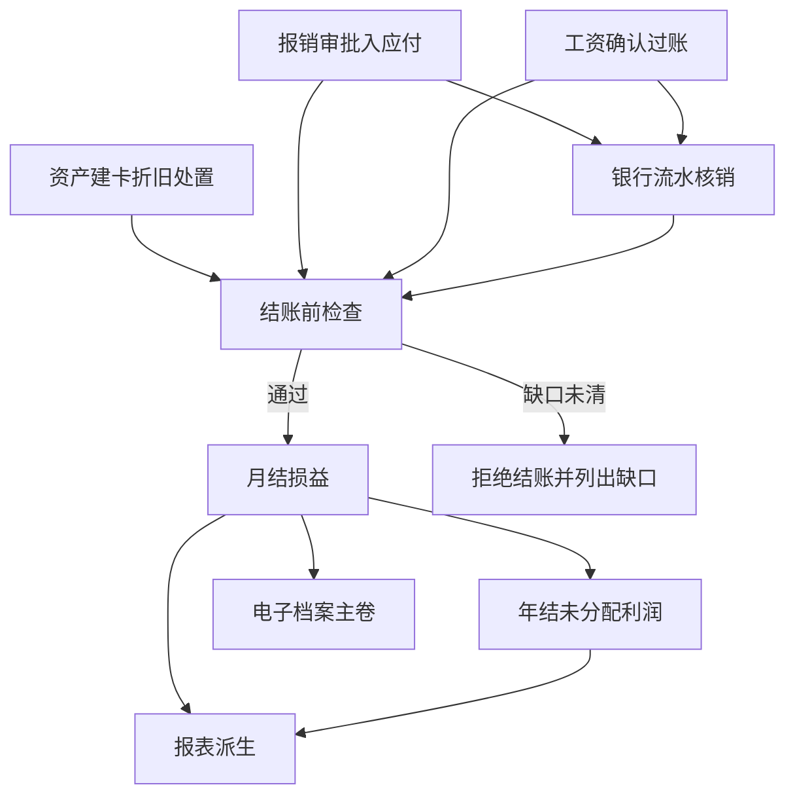

# 新财务系统全流程重建总设计

## 1. 目标与边界

**问题**：旧系统是单体 Node/JSON；新系统已在 Next.js + Prisma + PostgreSQL + shadcn 上建成账本积木与报销/工资闭环，但缺固定资产、正式三张报表、电子档案主卷归集，尚不能按「前端业务 → 账务 → 结账 → 报表 → 档案」日常上线。

**预期结果**：在**同一套账本积木**（账户 / 分录 / `postEntry`）上，用可组合的领域 API 覆盖：

报销与付款 · 工资社保个税 · 固定资产 · 期间结账 · 报表派生 · 电子档案归集。

**认知层目的**：系统是「财务事实工作台」——业务提议事实，财务确认后变成不可删改的分录；界面与脚本共用同一 API。

**非目标（本总设计明确不做或后置）**：

- 把旧 `server.js` 整文件搬迁。
- 多组织 / 多账簿并行、合并报表、全面预算、进销存。
- 金蝶/用友式全部变动单（部门转移、评估、减值）第一期不做。
- 旧资产初始化（旧系统已确认「上线后新增」；本版同样从启用日起新增）。
- 税务局在线接口、真实云 OSS（BlobStore 抽象已预留）。
- 高企研发三口径完整包（旧有切片；新系统后置）。

**技术约束**：Next.js + Prisma + PostgreSQL + shadcn；考拉哲学：积木优先、API-first、事前设计、活页报告同提交更新。

## 2. 调研结论

| 来源 | 采用 | 拒绝/改进 |
|---|---|---|
| 金蝶固定资产流程 | 卡片核心；次月起提；处置当月先提后处置；结账前折旧完成 | 不搬多会计政策 / 拆合卡平台 |
| 用友月末处理 | 计提→制单→对账→结账 | 「批量制单」在我们这里就是 `postEntry` |
| 旧系统 FA / 结账 / 档案 | 残值率直线法、分币尾差最后一期吸收、凭证主卷编号、结账缺口清单 | 拒绝 JSON 队列与前端预览当真源 |
| [yoshimoto-a/bookkeeping](https://github.com/yoshimoto-a/bookkeeping) | Asset + DepreciationRun → Journal | 日税口径不搬；我们用分与中国科目 |
| ERPNext / Odoo 会计 | 资产折旧过总账 | 不引整套 ERP |
| 已建成 ledger | 复用 postEntry、期间锁、BlobStore、工资/报销 | 不另起总账 |

**一般形式**：一切业务模块 =「提议分录的单据」+「过账」+「可追溯附件」。报表与档案是已过账事实的**派生视图**，不是第二套账。

## 3. 全流程（正常 + 关键失败）

结账门槛（新系统已有 + 待补）：

| 检查 | 状态 |
|---|---|
| 未完报销 | 已有 |
| 未匹配流水 | 已有 |
| 未完工资 | 已有 |
| 应提未提折旧 | **已有**（`PERIOD_HAS_OPEN_DEPRECIATION`） |
| 试算借贷平衡 | 由 postEntry 保证；报表另做勾稽 |

## 4. 积木地图（状态与数据）

| 积木 | 权威所有者 | 过账 | 设计文档 |
|---|---|---|---|
| 账本三件套 | ledger | postEntry | 既有 |
| 报销/附件/发票/付款 | claim/payment | GM 过账 / 出纳匹配 | 既有 |
| 工资/税局/期初/CSV | payroll | 计提与付实发 | 既有 |
| **固定资产** | fixed-asset | 购置/折旧/处置 | `fixed-assets.md` |
| **报表派生** | reports | 只读 | `reports.md` |
| 电子档案主卷 | archive | 只读归集 | `electronic-archive.md`（待写） |

## 5. 接口稳定性原则

- 写接口：鉴权、revision、mutationId、结构化错误码 + next。
- 读接口：可分页、默认可猜字段名。
- 无「只能点 UI」的操作。

## 6. 文件变更（本总设计）

| 操作 | 路径 | 原因 |
|---|---|---|
| 新增 | `design/rebuild-roadmap.md` | 总图与边界 |
| 新增 | `design/report.html` | 活页报告 |
| 新增 | `design/fixed-assets.md` | 下一块积木设计 |
| 修改 | `overview.html` / `AGENTS.md` | 注意力链 |

## 7. 实施编排

| ID | 任务 | 依赖 | 执行者 | 验证 |
|---|---|---|---|---|
| R0 | 本文 + report.html | — | 主代理 | 文档可读 |
| R1 | 固定资产建卡/折旧/处置/结账门槛 | R0 | 主代理 | 单测+curl |
| R2 | 资产负债/利润表（小企业口径简化） | R1 | 主代理 | 与试算勾稽 |
| R3 | 按凭证号归集附件与业务引用 | R2 | 主代理 | 查询 API |
| R4 | close checklist 聚合 | R1–R3 | 主代理 | 一页缺口 |

全部串行主代理；大并行仅在文件不重叠时再开子代理。

## 8. 验证与风险

- 每一积木独立可测；结账门槛回归。
- 风险：报表科目映射与旧模板不完全一致——以小企业常用科目 + 现有种子科目为先，映射表可配置后置。
- 风险：电子档案合规「四性检测」完整套件过大——本版做可追溯主卷 + 哈希，签章后置。
