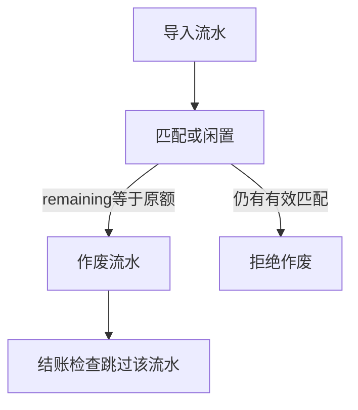

# 作废未匹配银行流水

## 1. 目标与边界

**问题**：流水导错或重复导入后，`remainingCents>0` 会阻断月结；当前无法删掉或作废。

**预期结果**：出纳/财务可作废「从未匹配过」或「匹配已全部撤销」的流水（`remainingCents === cents`）；作废后不再参与调节与结账检查。

**非目标**：作废已有有效匹配的流水（须先撤销匹配）、物理删除审计记录、红冲账（流水本身不过账）。

**关键约束**：流水只是匹配材料；作废是元数据状态，不写账本分录。

## 2. 流程

## 3. 数据

| 字段 | 用途 |
|---|---|
| BankStatement.voidedAt | 作废时间；空=有效 |
| BankStatement.voidedBy | 操作人显示名 |
| BankStatement.voidRemark | 原因 |

结账与调节只统计 `voidedAt IS NULL` 的流水。

## 4. 接口

`POST /api/books/[bookId]/statements/[statementId]/void` `{remark}`

鉴权：cashier|finance。

## 5. 验证

导入未匹配流水 → 结账失败 → 作废 → 结账成功。
