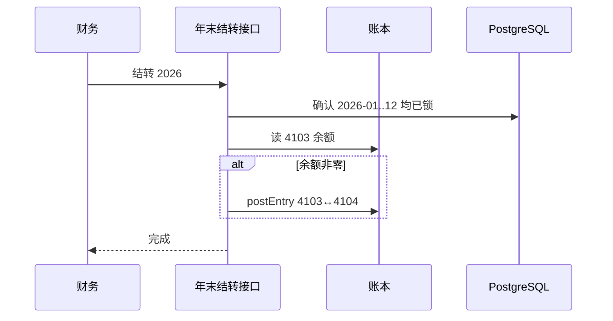

# 年末结转未分配利润

## 1. 目标与边界

**问题**：各月已把损益结到 `4103 本年利润`，年底需要把本年利润归集到 `4104 未分配利润`，否则跨年利润科目一直挂着。

**预期结果**：财务对某一年执行年末结转：把 `4103` 当前余额转到 `4104`；幂等；可红冲撤销。

**非目标**：利润分配明细（分红、公积金）、企业所得税计提、多步分配方案。

**关键约束**：要求该年 1–12 月均已锁期；结转日 `YYYY-12-31`；走 `postEntry`（`ye-close`/`ye-reopen` 允许写入已锁 12 月）。零余额也记一条 `YearClose`，不造假分录。

## 2. 流程

## 3. 数据

| 项 | 说明 |
|---|---|
| 4104 | 未分配利润（权益，开账种子） |
| reference `ye-close:YYYY` | 结转幂等键 |
| reference `ye-reopen:YYYY` | 撤销红冲 |

## 4. 接口

- `POST /api/books/[bookId]/year-end/close` `{year, remark?}` finance|gm
- `POST /api/books/[bookId]/year-end/reopen` `{year, remark}` finance|gm

## 5. 验证

十月费用结账后 4103 有余额；锁满 1–12（测试可只锁有发生月并在测试里直接种锁）→ 年末结转后 4103=0，4104 承接。
